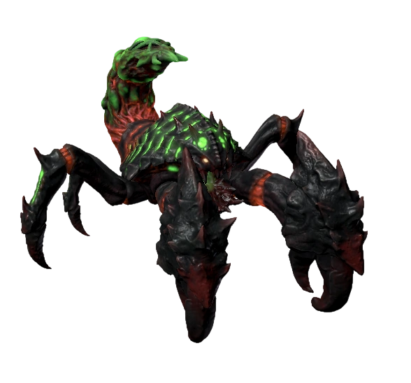
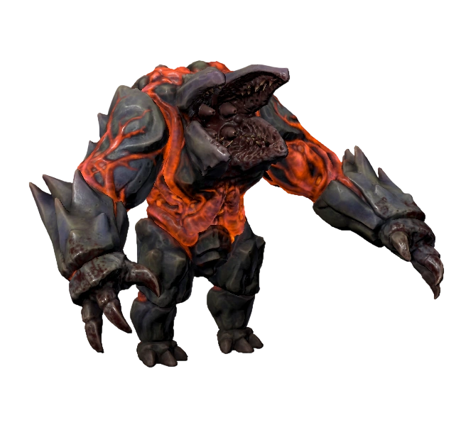

# Cliffside

There will be 12 types of enemies you'll encounter in the Cliffside.

<table><thead><tr><th width="222.20703125">Wasteland</th><th>HP</th><th>Attack 1</th><th>Attack 2 </th><th>Attack 3</th><th>Attack 4</th><th data-hidden data-type="files"></th></tr></thead><tbody><tr><td>
<figure><figcaption>
<strong>Scorpion Monarch (Boss)</strong>
</figcaption></figure>
</td><td>3500</td><td>
Claw Strike

</td><td>
Venom Shots

</td><td>
Toxic Bullet Hell

</td><td>
Neurotoxin Blob

</td><td><a</a></td></tr><tr><td>
<figure><figcaption>
<strong>Juggernaut (Boss)</strong>
</figcaption></figure>
</td><td>4000</td><td>
Charging Strikes

</td><td>
Power Smash

</td><td>
Fissure Smash

</td><td>
Chitin Shots

</td><td></td></tr><tr><td>
<figure><figcaption>
<strong>Boom Spider</strong>
</figcaption></figure>
</td><td>

12 - 48
</td><td>
Slash

</td><td>
Explosion

</td><td></td><td></td><td></td></tr><tr><td>
<figure><figcaption>
<strong>Stoneman</strong>
</figcaption></figure>
</td><td>40 - 115</td><td>
Punch

</td><td>
Twin Rift

</td><td></td><td></td><td></td></tr><tr><td>
<figure><figcaption>
<strong>Underground Mouth</strong>
</figcaption></figure>
</td><td>20 - 50</td><td>
Needle Spew

</td><td>Underground movement</td><td></td><td></td><td></td></tr><tr><td>
<figure><figcaption>
<strong>Sandworm</strong>
</figcaption></figure>
</td><td>35 - 98</td><td>
Acid Bomb

</td><td>Underground movement</td><td></td><td></td><td></td></tr><tr><td>
<figure><figcaption>
<strong>Walker</strong>
</figcaption></figure>
</td><td>20 - 70</td><td>
Mycotoxin Shot

</td><td>
Halting Hail

</td><td>Healing Shot </td><td></td><td></td></tr><tr><td>
<figure><figcaption>
<strong>Skinny dog</strong>
</figcaption></figure>
</td><td>18 - 48</td><td>
Claw Attack

</td><td>
Dirt Bomb

</td><td>
Sprint

</td><td></td><td></td></tr><tr><td>
<figure><figcaption>
<strong>Gray Wasp</strong>
</figcaption></figure>
</td><td>22 - 56</td><td>
Bite

</td><td>
Charge

</td><td></td><td></td><td></td></tr><tr><td>
<figure><figcaption>
<strong>Heavy Roller</strong>
</figcaption></figure>
</td><td>45 - 120</td><td>
Bite

</td><td>Armored Roll </td><td></td><td></td><td></td></tr><tr><td>
<figure><figcaption>
<strong>Mother Bee</strong>
</figcaption></figure>
</td><td>26 - 72</td><td>
Spit

</td><td>
Lay Cocoon

</td><td></td><td></td><td></td></tr><tr><td>
<figure><figcaption>
<strong>Giant Scorpion</strong>
</figcaption></figure>
</td><td>25 - 78</td><td>
Sting

</td><td>
Venom Projectiles

</td><td>
Speed Boost

</td><td></td><td></td></tr></tbody></table>

\
**Certain size** [**Cliffside**](../maps/cliffside.md) **enemies can be found at certain times of day:**

| Name                                                                 | Morning | Day | Evening | Night |
| -------------------------------------------------------------------- | ------- | --- | ------- | ----- |
| .png>)Scorpion Monarch (Boss) | Yes     | Yes | Yes     |       |
| .png>)Juggernaut (Boss)       |         | Yes | Yes     | Yes   |
| .png>)Boom Spider             | Yes     | Yes | Yes     | Yes   |
| .png>)Stoneman                | Yes     |     |         | Yes   |
| .png>)Underground Mouth       | Yes     | Yes |         |       |
| .png>)Sandworm                |         |     | Yes     | Yes   |
| .png>)Walker                  | Yes     | Yes | Yes     | Yes   |
| .png>)Skinny Dog              | Yes     | Yes | Yes     | Yes   |
| .png>)Gray Wasp               |         | Yes | Yes     | Yes   |
| .png>)Heavy Roller            | Yes     | Yes | Yes     |       |
| .png>)Mother Bee              | Yes     |     | Yes     | Yes   |
| .png>)Giant Scorpion          | Yes     | Yes | Yes     | Yes   |

**Note: During the day and evening either boss has a chance to spawn but never both.**
