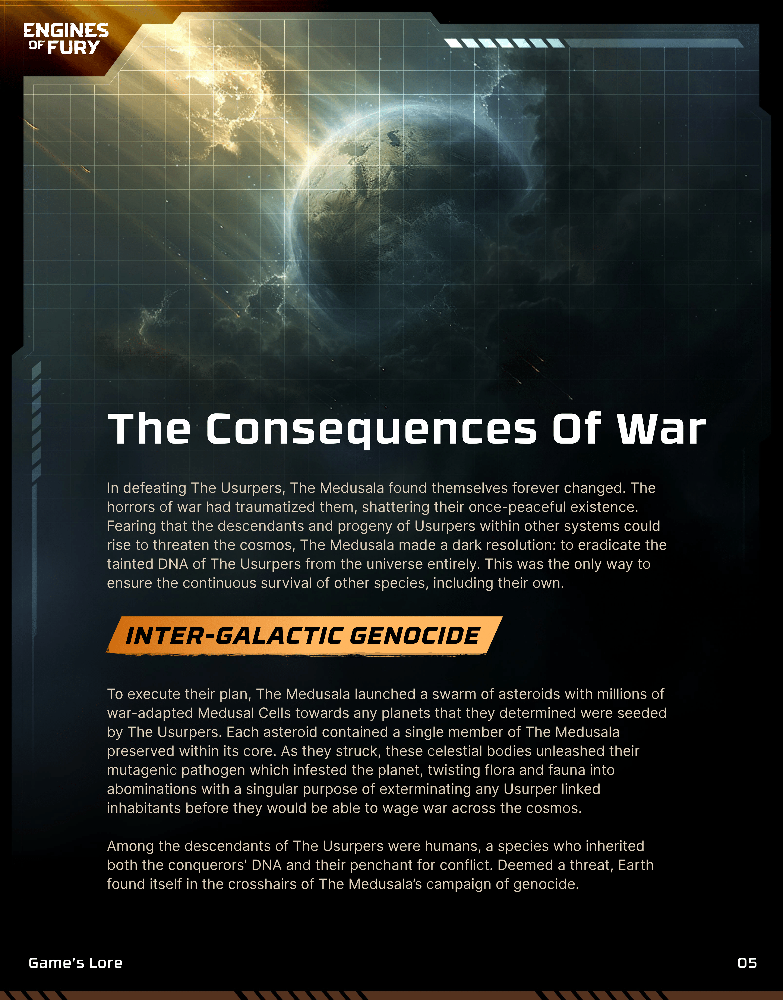
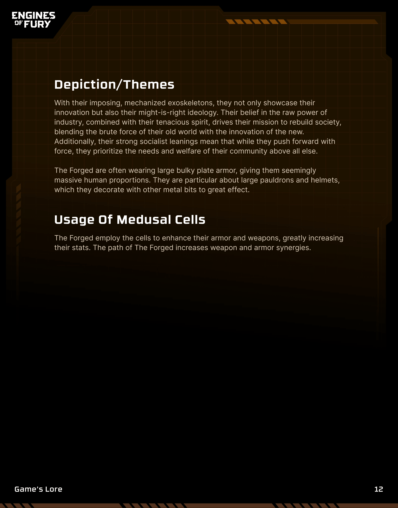
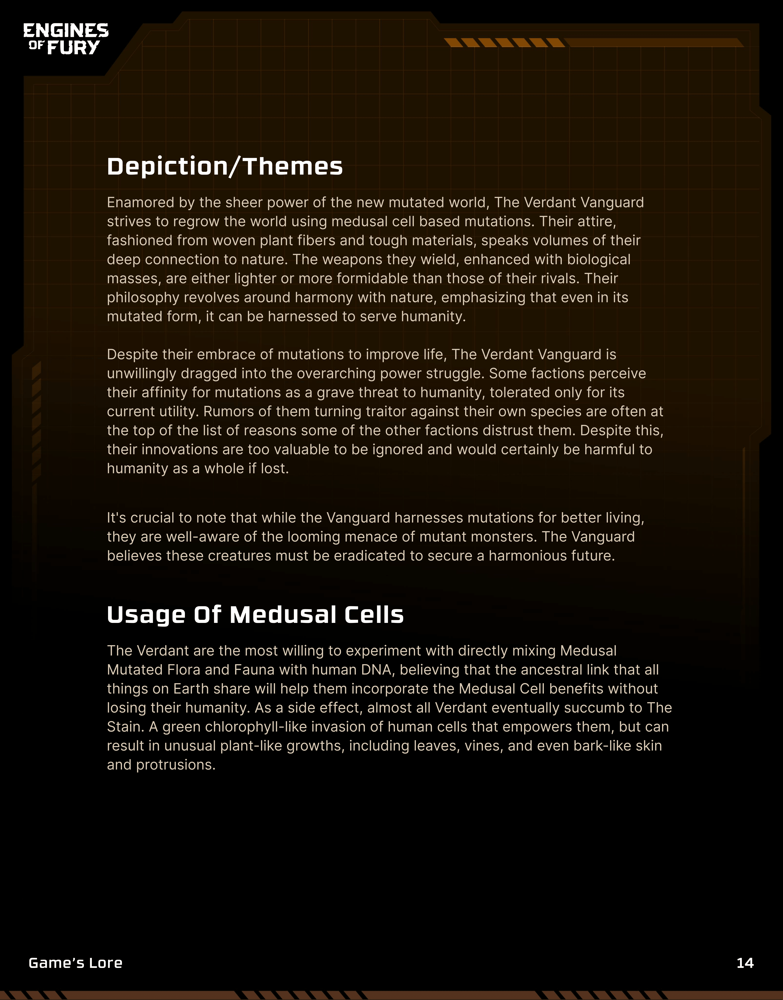
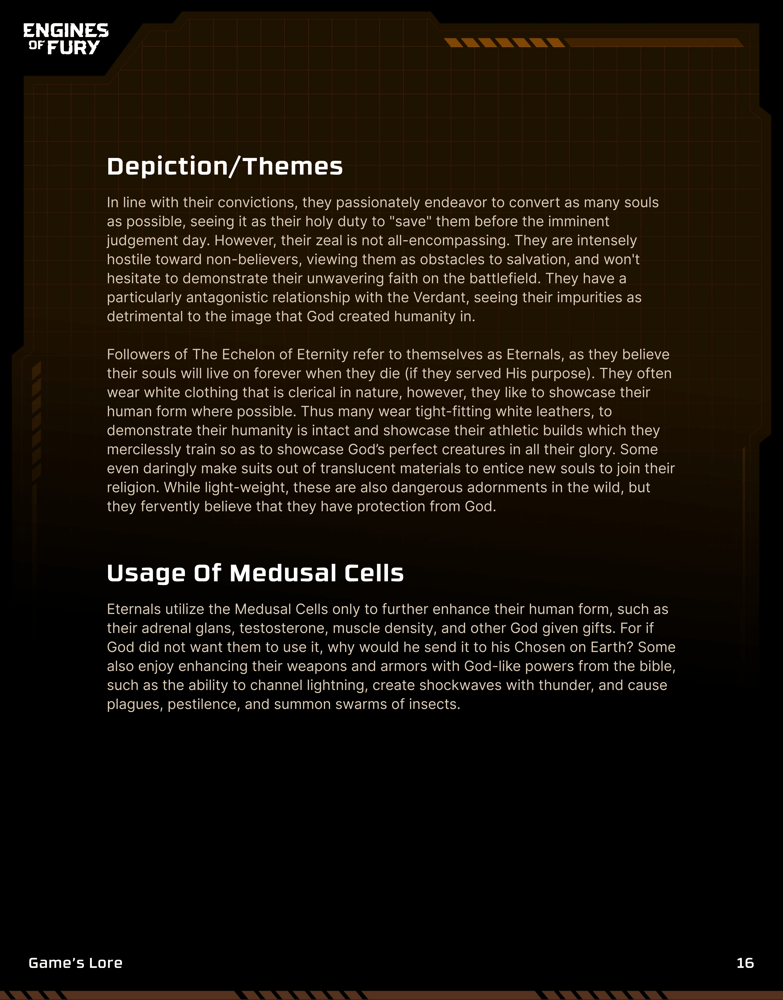
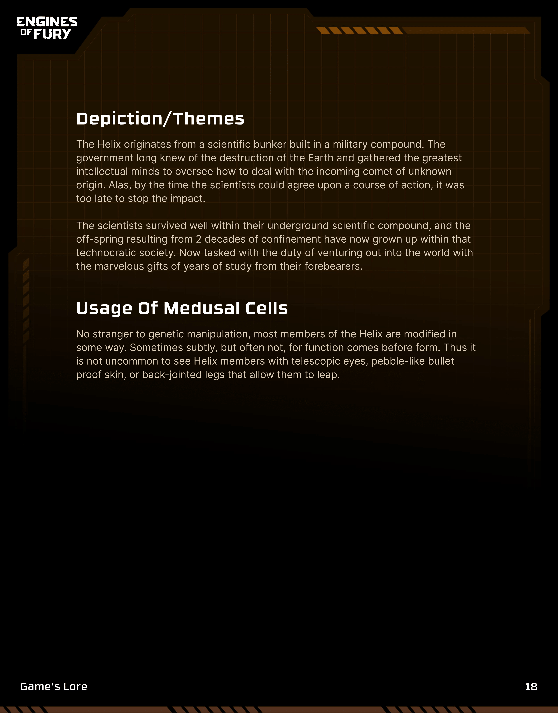

# Game Lore

The Universe of Engines of Fury is vast and full of terrors, but our [story](../story.md) begins on a post-apocalyptic Earth, scarred from a meteor that contained a mutagenic virus that spread across the world. As the surface of the world has become harsh and mostly uninhabitable due to the mutagenic plague turning flora and fauna into grotesque [monsters](../enemies/), humanity has moved underground. Within the City of Stoneport, civilization has begun again, hoping to push out to the surface and eventually take it back for humanity.

Origin of the Conflict

The Consequences of War

<figure><figcaption></figcaption></figure>

Alien Races

<figure><figcaption></figcaption></figure>

The Usurpers

<figure><figcaption></figcaption></figure>

The Impact

<figure><figcaption></figcaption></figure>

The Engines

<figure><figcaption></figcaption></figure>

Factions

<figure><figcaption></figcaption></figure>

The Forged

<figure><figcaption></figcaption></figure> <figure><figcaption></figcaption></figure>

The Verdant

<figure><figcaption></figcaption></figure> <figure><figcaption></figcaption></figure>

The Echelon of Eternity

<figure><figcaption></figcaption></figure> <figure><figcaption></figcaption></figure>

The Helix

<figure><figcaption></figcaption></figure> <figure><figcaption></figcaption></figure>

