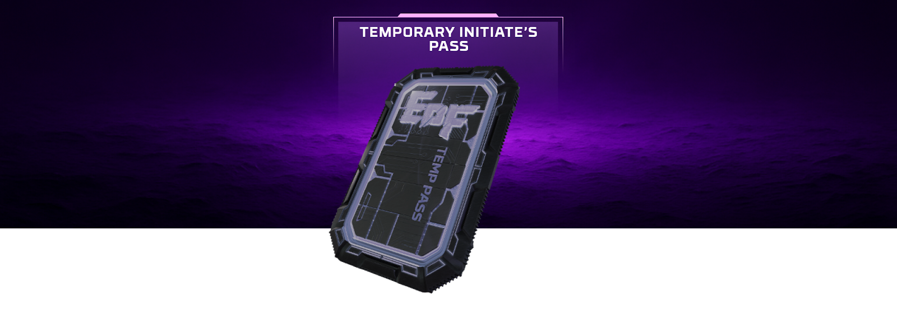

# Temporary Initiate's Pass

<figure><figcaption></figcaption></figure>

The temporary Initiate’s Pass (non-NFT, valid only for the current season)\
Holding this pass grants Initiated Raider status and allows access to Council Caches within a 5-hour window each day. Temporary pass is not an NFT & is valid for the entire season but will removed with the monthly wipe.\
\
**Obtaining the Temporary Initiate's Pass:**
\
Temporary Initiate’s Pass can be purchased at the Hideout [Trading Station](https://eofwiki.github.io/wiki-eof/#/key-economic-hubs/trading-station) for 2000 [FURY](https://eofwiki.github.io/wiki-eof/#/economy/dual-currencies/fury). (Pricing may be adjusted in future updates)\
\
**How long does the Temporary Initiate’s Pass remain active after obtaining it?**
\
Temporary Initiate’s Pass stays active until the next monthly wipe after the purchase.\
For example, if you obtain it 20 days before the wipe, it will remain active for 20 days. If you obtain it 4 days before the wipe, it will remain active for 4 days.\
\
**Becoming an Initiated Raider:**
\
Once obtained at the trading station, you will receive a temporary Initiate’s Pass in your inventory. Activate it by pressing the NFT Slot button in your hideout and placing it in the Initiate Status slot. This status serves as a prerequisite for accessing high-tier economic activities in the game.\
\
**A Window of Opportunity:**
\
The Initiated Raider status allows you to open special Council Caches. This ability is active for 5 hours each day, with the timer starting the moment you enter your first raid of that 24-hour period. After the 5-hour window closes, your status is suspended until the next daily reset.\
\
**What are Council Caches?**
\
These are visually unique lootboxes found during raids that can only be unlocked by Initiated Raiders. Each map contains six Council Caches. At least one is guaranteed to hold a rare [Faction Shard](https://eofwiki.github.io/wiki-eof/#/utility-nfts/faction-shards-and-lockboxes), while the others contain a small amount of 1 or 2 [ALLOY](https://eofwiki.github.io/wiki-eof/#/economy/dual-currencies/alloy). 
