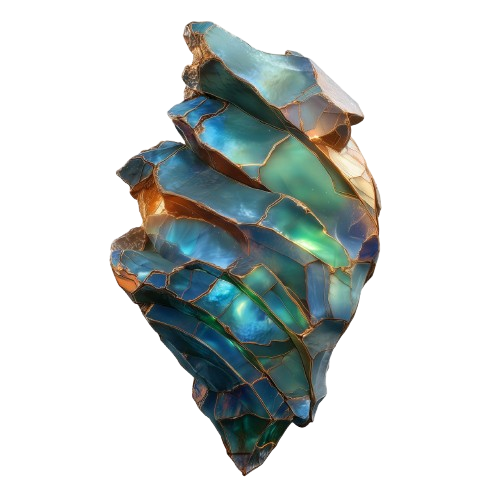

# Faction Lockbox Loot & Summary

Once a Lockbox is placed in an activated Engine Cores, it will begin an 20-hour unlocking process. When complete, the lockbox yields a random but significant amount of ALLOY - between 100 to 10,000. This makes mastering the Faction Lockbox lifecycle the primary strategy for acquiring large quantities of ALLOY and a cornerstone of efficient skill of resource gathering in-game.

<table data-header-hidden><thead><tr><th></th><th></th><th width="164"></th><th></th></tr></thead><tbody><tr><td><strong>NFT Name</strong></td><td><strong>Function</strong></td><td><strong>How to Acquire</strong></td><td><strong>Role in the Economy</strong></td></tr><tr><td><a>Initiate's Pass</a></td><td>Grants “<a>Inititated Raider</a>” access to Council Caches in raids.</td><td>TokenTrove limited sales; external platforms (NFT Marketplaces).</td><td>Access to council caches in raids.</td></tr><tr><td><a>Faction Shard</a></td><td>Component <a href="./">utility NFT</a>, collect 5 to craft a <a>Lockbox</a>.</td><td>Raids (council caches, other players), external platforms.</td><td>Main ingredient for crafting a Lockbox.</td></tr><tr><td><a>Lockbox</a></td><td>Collectable <a>The Engine</a>.</td><td>Crafted by combining 5 identical <a>Faction Shard</a> NFTs.</td><td>Rare item used in <a>ALLOY</a>.</td></tr><tr><td><a >Engine Core</a> (Rare, Legendary, Furious)</td><td>Collectable <a href="./">utility NFT</a>, required to turn on <a>The Engine</a>.</td><td>TokenTrove limited sales; external platforms (NFT Marketplaces).</td><td>The only item that can turn on <a>The Engine</a> in order to open <a href="faction-shards-and-lockboxes.md">Lockboxes</a>.</td></tr></tbody></table>
